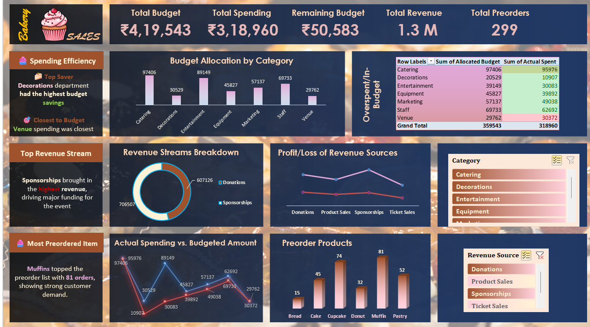

# 🧁 Bakery Budget Dashboard

A fully interactive and filter-enabled **Excel dashboard** built to analyze and visualize the financial planning and performance of a bakery event. Designed for ease of use, this dashboard gives real-time insights into budgets, revenue, and product demand—all through smart filtering and visual storytelling.

---

## 📊 Project Overview

This dynamic dashboard allows users to:

- 🎯 Filter by departments or categories to view specific totals
- 💰 Track budget vs actual spending
- 📈 Analyze revenue distribution
- 🧾 Understand preorder demand per product
- ✅ Quickly identify performance status through KPIs

---

## 🛠️ Tools Used

| Tool        | Purpose                                        |
|-------------|------------------------------------------------|
| **Excel**   | Dashboard interface, filters, visual analytics |
| **SQL**     | Data extraction & preprocessing                |

---

## 📌 KPIs & Visuals Tracked

| KPI / Visual                    | What it Shows |
|--------------------------------|----------------|
| 📦 **Total Allocated Budget**         | Auto-updates based on filters |
| 💸 **Total Actually Spent**           | Shows filtered actual spending |
| 📈 **Total Revenue**                  | Displays income from all sources |
| 🧾 **Total Preorders**               | Product demand overview |
| 🔁 **Profit/Loss by Revenue**         | Net gain/loss by stream |
| 📊 **Budget Allocation by Category** | Dynamic chart per department |
| 🧩 **Revenue Stream Breakdown**       | Donut chart of income sources |

---

## ✨ Dashboard Features

- ✅ **Live KPI Updates** – All totals and charts auto-update when filters are applied
- 🧠 **Insight Boxes** – Summary of key findings
- 🧮 **Interactive Filters** – Instantly view data for specific categories or departments
- 📈 **Dynamic Charts** – Clear and colorful visuals to support storytelling
- 🔴🟢 **Conditional Formatting Alerts** – Intelligent visual feedback using color rules in the "In-Budget / Overspending" table:

### 🎨 Conditional Formatting Logic

| Condition                                         | Rule Used                                               | Color  |
|--------------------------------------------------|----------------------------------------------------------|--------|
| **Overspending Alert**                           | `=Actual_Spent > Budget_Allocated`                      | 🔴 Red |
| **In-Budget Status**                             | `=Actual_Spent <= Budget_Allocated`                     | 🟢 Green |
| **Near-Budget Warning (Optional, 90–100%)**      | `=AND(Actual_Spent > 0.9 * Budget_Allocated, Actual_Spent <= Budget_Allocated)` | 🟡 Yellow |

> These rules are applied to individual rows within the department table using **Conditional Formatting Rules Manager** in Excel.

This makes it instantly clear which departments are:

- Exceeding their budget (highlighted in **Red** 🔴)
- Staying within limits (highlighted in **Green** 🟢)
- Approaching the limit (optional logic in **Yellow** 🟡)

The visual alerts help users **quickly spot budget anomalies** without needing to manually check numbers.

---

## 🧠 Sample Insights

- 🎯 All departments stayed within budget
- 🏆 **Decorations** saved the most from its allocated budget
- 💼 **Sponsorships** drove the highest revenue
- 🧁 **Muffins** were the top-preferred product
- ⏰ Peak preorder times occurred on **Friday: 12–1 PM & 4–8 PM**

---

